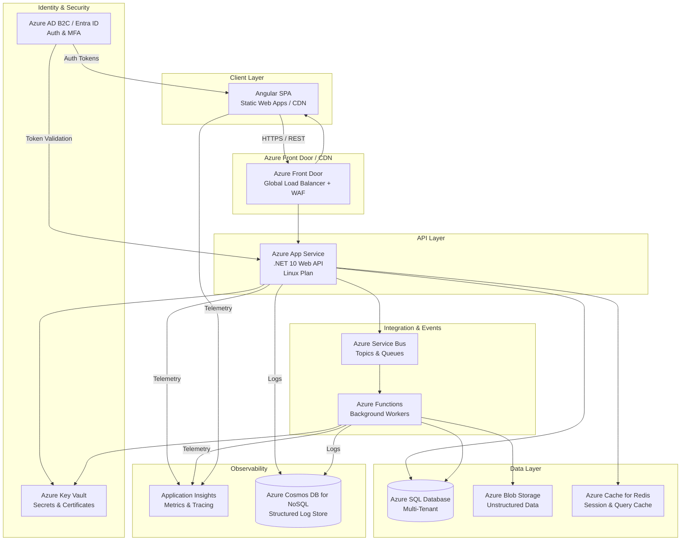
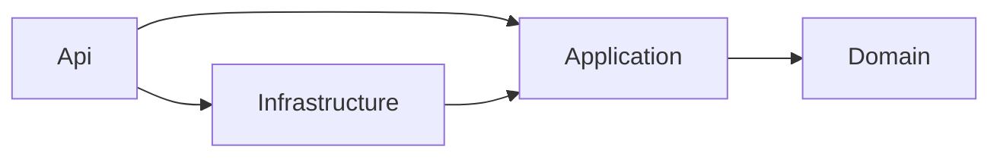
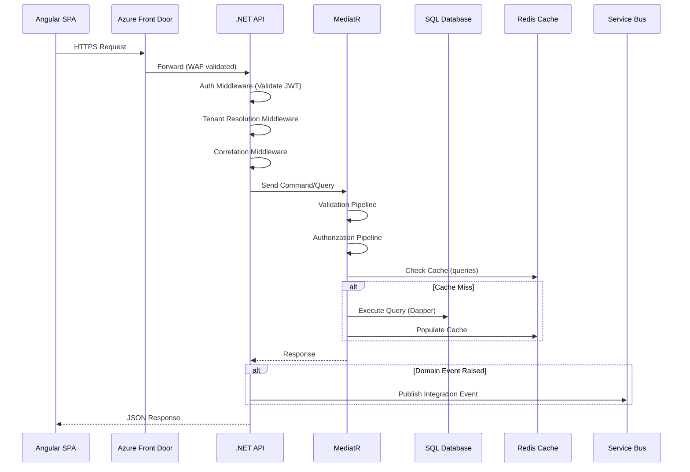
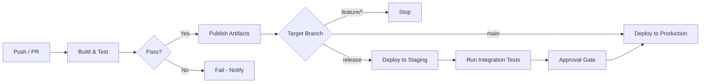
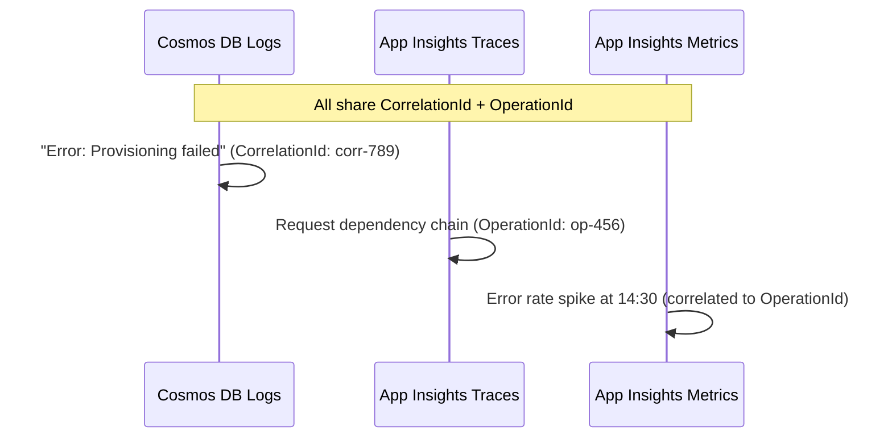

# System Architecture

## Document Purpose

This document defines the system-level architecture for the ICM SaaS platform — a multi-tenant application built with **Angular** (frontend), **.NET 10 Web API** (backend), and **SQL Server** (data), hosted on **Microsoft Azure**. It establishes architectural principles, component boundaries, technology decisions, and operational patterns that guide all development efforts.

---

## 1. Architecture Principles

| Principle | Description |
|---|---|
| **Separation of Concerns** | UI, business logic, and data access are cleanly separated across layers and projects. |
| **Multi-Tenancy by Design** | Every layer — from the database to the UI — is tenant-aware. Tenant isolation uses a shared-database, row-level model with `TenantId` partitioning. |
| **API-First** | All business capabilities are exposed through versioned REST APIs. The Angular SPA consumes only the public API surface. |
| **Infrastructure as Code** | All Azure resources are provisioned via Bicep. No manual portal changes in production. |
| **Security in Depth** | Defense at every layer: network, identity, application, and data. |
| **Observability** | Structured logging, distributed tracing, and metrics are built in from day one. |
| **Cost-Aware** | Resources are right-sized. Auto-scale rules keep costs proportional to usage. |
| **Resilience** | Transient failures are handled with retry policies, circuit breakers, and graceful degradation. |

---

## 2. High-Level Architecture



---

## 3. Frontend Architecture — Angular SPA

### 3.1 Technology Stack

| Concern | Technology |
|---|---|
| Framework | Angular 19+ (standalone components) |
| Language | TypeScript 5.x, strict mode |
| State Management | NgRx SignalStore |
| UI Component Library | Tailwind CSS + Angular CDK |
| HTTP Client | Angular `HttpClient` with interceptors |
| Build | Vite (via Angular CLI / esbuild) |
| Testing | Jest (unit), Playwright (E2E) |

### 3.2 Project Structure (Feature-Based)

```
src/
├── app/
│   ├── core/                 # Singleton services, guards, interceptors
│   │   ├── auth/
│   │   ├── http/
│   │   └── logging/
│   ├── shared/               # Shared components, directives, pipes
│   │   ├── components/
│   │   ├── directives/
│   │   └── pipes/
│   ├── features/             # Lazy-loaded feature modules
│   │   ├── dashboard/
│   │   ├── tenants/
│   │   ├── users/
│   │   └── billing/
│   ├── layout/               # Shell, nav, footer
│   │   ├── main-layout/
│   │   └── auth-layout/
│   └── app.config.ts         # Standalone bootstrap configuration
├── environments/
└── assets/
```

### 3.3 Key Patterns

- **Standalone Components**: No `NgModule`. Every component, pipe, and directive is standalone.
- **Signals for State**: `signal()`, `computed()`, and `effect()` for local state; NgRx SignalStore for feature-level state.
- **Lazy Loading**: Every feature is loaded lazily via the Angular Router.
- **HTTP Interceptors**: Centralized auth token injection, tenant header injection, error normalization, and telemetry correlation.
- **Tenant Context**: The current tenant is resolved on app load (from subdomain or path) and provided globally.

### 3.4 API Communication

| Header | Purpose |
|---|---|
| `Authorization: Bearer <token>` | JWT from Azure AD B2C / Entra ID |
| `X-Tenant-Id: <guid>` | Tenant context for every request |
| `X-Correlation-Id: <guid>` | Distributed tracing correlation |
| `Accept: application/json` | Content negotiation |
| `x-api-version: 2025-01-01` | API version routing |

---

## 4. Backend Architecture — .NET 10 Web API

### 4.1 Technology Stack

| Concern | Technology |
|---|---|
| Runtime | .NET 10 (LTS) |
| API Framework | ASP.NET Core Minimal APIs |
| ORM | Dapper |
| Validation | FluentValidation |
| Background Jobs | Azure Functions (isolated process) |
| Messaging | Azure Service Bus + MassTransit |
| Caching | Azure Cache for Redis + `IDistributedCache` |
| Logging | Serilog → Azure Cosmos DB for NoSQL |
| Resilience | Polly + `Microsoft.Extensions.Http.Resilience` |
| Testing | xUnit, NSubstitute, Testcontainers |

### 4.2 Solution Structure

```
src/
├── Api/                          # ASP.NET Core host, middleware, endpoints
│   ├── Endpoints/                # Minimal API endpoint groups (by feature)
│   ├── Middleware/
│   └── Program.cs
├── Application/                  # Use cases, commands, queries, DTOs
│   ├── Features/
│   │   ├── Tenants/
│   │   ├── Users/
│   │   └── Billing/
│   ├── Common/
│   │   ├── Behaviors/            # MediatR pipeline behaviors
│   │   └── Interfaces/
│   └── DependencyInjection.cs
├── Domain/                       # Entities, value objects, domain events
│   ├── Entities/
│   ├── ValueObjects/
│   ├── Events/
│   └── Exceptions/
├── Infrastructure/               # Dapper, external services, messaging
│   ├── Persistence/
│   │   ├── Sql/                   # SQL scripts, stored procedures, migrations
│   │   └── Migrations/
│   ├── Services/
│   └── Messaging/
└── Contracts/                    # Shared DTOs for inter-service communication
```

### 4.3 Clean Architecture with Minimal APIs

The backend follows **Clean Architecture** (onion/hexagonal). Dependencies point inward:



- **Domain** — Zero external dependencies. Pure entities, value objects, and domain events.
- **Application** — Use cases orchestrated via MediatR. Depends only on Domain.
- **Infrastructure** — Dapper `SqlConnection` wrappers, Azure Service Bus clients, blob storage, email services. Implements interfaces defined in Application.
- **Api** — Thin shell. Maps endpoints, wires middleware, registers services.

### 4.4 Request Pipeline (Typical Flow)



### 4.5 Minimal API Endpoint Pattern

```csharp
// Example: Api/Endpoints/Tenants/TenantEndpoints.cs
public static class TenantEndpoints
{
    public static void MapTenantEndpoints(this IEndpointRouteBuilder routes)
    {
        var group = routes.MapGroup("/api/tenants")
            .RequireAuthorization()
            .WithTags("Tenants");

        group.MapGet("/", async (IMediator mediator, CancellationToken ct) =>
            Results.Ok(await mediator.Send(new GetTenantsQuery(), ct)))
            .Produces<IReadOnlyList<TenantDto>>()
            .WithName("GetTenants");

        group.MapGet("/{id:guid}", async (Guid id, IMediator mediator, CancellationToken ct) =>
        {
            var result = await mediator.Send(new GetTenantByIdQuery(id), ct);
            return result is null ? Results.NotFound() : Results.Ok(result);
        })
        .Produces<TenantDto>()
        .Produces(StatusCodes.Status404NotFound)
        .WithName("GetTenantById");
    }
}
```

### 4.6 Multi-Tenant Strategy

- **Row-Level Tenancy**: Every table includes a `TenantId` column (non-nullable `uniqueidentifier`).
- **Query Isolation**: Every SQL query and stored procedure includes a `WHERE TenantId = @TenantId` clause. The repository layer enforces this convention.
- **Tenant Resolution**: Middleware extracts `X-Tenant-Id` header → validates user belongs to tenant → sets `ITenantContext.TenantId` → injected into repository calls via `SqlConnection` extension.
- **Data Isolation**: Enforced at the query level; mandatory tenant filter in every repository method. No raw SQL elsewhere that bypasses the filter.

---

## 5. Data Architecture — SQL Server

### 5.1 Database Design Principles

- **Schema ownership**: All application objects reside in `dbo` (or dedicated `app` schema).
- **Migrations**: All schema changes are managed through versioned SQL migration scripts (e.g., DbUp or FluentMigrator) — the source of truth for database state. Scripts are idempotent and run as part of CI/CD deployment.
- **Row-Level Security (RLS)**: Supplementary guard in the database layer — predicates match the `TenantId` filter.
- **Idempotent Scripts**: All manual SQL scripts check for existence before creating or altering.

### 5.2 Indexing Strategy

| Index Type | When to Use |
|---|---|
| Clustered Index | Primary key. Defaults to `Id` (`uniqueidentifier`, non-sequential — use `NEWSEQUENTIALID()` or prefer `int`/`bigint` for PK, use GUID only for external reference). |
| Non-Clustered Index | `TenantId`, foreign keys, columns in `WHERE`/`JOIN`/`ORDER BY`. |
| Filtered Index | Columns with well-known subsets (e.g., `WHERE IsDeleted = 0`). |
| Columnstore Index | Large fact/reporting tables. |

### 5.3 Query Performance

- Use Dapper's buffered queries by default; use `QueryAsync<T>(..., buffered: false)` for large result sets to stream rows without loading them all into memory.
- Prefer pagination with keyset (seek) pagination over `OFFSET/FETCH` for large datasets.
- Use `Query Store` enabled on Azure SQL Database for query performance insights.
- Use stored procedures for complex multi-statement operations to reduce round-trips and benefit from cached execution plans.

### 5.4 Backup & Retention

- **Azure SQL Database**: Automated backups (7–35 day retention, configurable per environment).
- **Long-Term Retention (LTR)**: Weekly/monthly/yearly backups for compliance; stored in geo-redundant storage.
- **Geo-Replication**: Active geo-replication to a paired region for disaster recovery.

---

## 6. Azure Infrastructure

### 6.1 Resource Map

| Resource | SKU (Minimum) | Purpose |
|---|---|---|
| Azure Front Door | Standard | Global load balancing, WAF, CDN |
| App Service Plan | P1v3 (Linux) | .NET API hosting |
| Azure SQL Database | S3 (50 DTU) | Primary transactional database |
| Azure Cache for Redis | C1 (1 GB) | Session state, response caching |
| Azure Service Bus | Standard | Async messaging between services |
| Azure Functions | Consumption | Background workers |
| Azure Blob Storage | Hot/Cool (LRS) | File uploads, static assets |
| Azure Key Vault | Standard | Secrets, connection strings, certificates |
| Application Insights | Workspace-based | Metrics, distributed tracing, alerting |
| Azure Cosmos DB for NoSQL | Serverless (or Autoscale 400 RU/s) | Structured log store |
| Azure AD B2C / Entra ID | — | Authentication and user management |

### 6.2 Environments

| Environment | Purpose | Naming Convention |
|---|---|---|
| `dev` | Development & integration testing | `{app}-{env}-{region}-{resource}` |
| `staging` | Pre-production validation | `{app}-stg-{region}-{resource}` |
| `prod` | Production | `{app}-prd-{region}-{resource}` |

> Example: `icm-prd-eastus-asp` (App Service Plan, Production, East US)

### 6.3 Networking

- **VNet Integration**: App Service integrated with a dedicated VNet (outbound traffic restricted).
- **Private Endpoints**: SQL Database, Storage Account, Cosmos DB, and Key Vault use Private Link (no public exposure).
- **Service Endpoints**: Redis and Service Bus accessible via VNet service endpoints.
- **Azure Front Door WAF**: OWASP Top 10 rule set, rate limiting, IP filtering at the edge.

### 6.4 Scaling Rules

| Resource | Scale Rule |
|---|---|
| App Service | CPU > 70% for 5 min → +1 instance (max 10). Memory-based rules as secondary. |
| Azure SQL | Auto-scale to next tier when DTU > 80% sustained for 10 min. |
| Azure Functions | Event-driven (Service Bus queue depth, blob triggers). |
| Azure Cosmos DB | Autoscale mode — scales RU/s within configured min/max range based on load. |

---

## 7. Security Architecture

### 7.1 Authentication & Authorization

```
[Angular SPA]
    │
    ▼
[Azure AD B2C / Entra ID]
    ├── Sign-up / Sign-in (with MFA)
    ├── Token Issuance (JWT — access + refresh tokens)
    │
    ▼
[.NET API]
    ├── JWT Bearer Authentication Middleware
    ├── Tenant Resolution Middleware
    ├── Role-Based Authorization (`[Authorize(Roles = "Admin")]`)
    └── Resource-Based Authorization (IAuthorizationHandler)
```

### 7.2 Secret Management

- **Zero secrets in code or config files.**
- All connection strings, API keys, and certificates stored in **Azure Key Vault**.
- App Service and Functions authenticate to Key Vault via **Managed Identity**.
- Key Vault references in App Service app settings: `@Microsoft.KeyVault(SecretUri=https://icm-prd-kv.vault.azure.net/secrets/ConnectionStrings--Default/)`.
- Key rotation follows a 90-day policy with automated renewal.

### 7.3 Data Protection

- **TLS 1.3** enforced for all ingress traffic (Front Door → App Service).
- **Encryption at Rest**: Azure SQL (TDE), Cosmos DB (service-managed keys), Blob Storage (service-managed keys).
- **Encryption in Transit**: HTTPS enforced everywhere; SQL connections use TLS.
- **Column-Level Encryption**: `Always Encrypted` for PII and sensitive financial data.
- **Data Masking**: Dynamic data masking on `Email` and `Phone` columns in non-production environments shared with developers.

### 7.4 OWASP Mitigations

| Threat | Mitigation |
|---|---|
| SQL Injection | Dapper parameterized queries — all user input bound via `@param`; validate all inputs |
| XSS | Angular's built-in sanitization; Content-Security-Policy header |
| CSRF | SameSite=Strict cookies; token-based auth (JWT in Authorization header) |
| Broken Access Control | Tenant-aware authorization handlers; row-level security in SQL |
| Sensitive Data Exposure | Always Encrypted; data masking; HTTPS everywhere |

---

## 8. DevOps & CI/CD

### 8.1 Branching Strategy

```
main          ← Production. Deploy to prod environment.
  └── release ← Staging. Deploy to staging environment.
        └── feature/* ← Active development. Merge to release via PR.
```

- Trunk-based development with short-lived feature branches.
- All merges require at least one peer review.
- Branch protection rules on `main` and `release`.

### 8.2 CI/CD Pipeline (GitHub Actions / Azure DevOps)



### 8.3 Pipeline Steps

1. **Restore** — NuGet + npm dependencies
2. **Lint** — ESLint for Angular, Roslyn analyzers for .NET
3. **Unit Tests** — Jest (frontend), xUnit (backend)
4. **Build** — `dotnet publish` (self-contained Linux), `ng build` (AOT + optimization)
5. **Containerize** — Docker image from multi-stage build
6. **Security Scan** — Container vulnerability scan, dependency audit
7. **Deploy** — Swap deployment to staging slot, smoke tests, then production swap
8. **Post-Deployment** — Run SQL migrations (DbUp/FluentMigrator), warm cache

---

## 9. Observability

### 9.1 Three Pillars

| Pillar | Tool | What We Track |
|---|---|---|
| **Logging** | Serilog → Azure Cosmos DB for NoSQL | Structured logs with `TenantId`, `CorrelationId`, `UserId`, `Severity`, `Source` enrichment |
| **Metrics** | Application Insights / Azure Monitor | Request rate, latency (p50/p95/p99), error rate, DTU %, cache hit ratio |
| **Tracing** | Application Insights / OpenTelemetry | End-to-end request flow: Front Door → API → SQL → Service Bus → Function |

### 9.2 Log Storage — Cosmos DB for NoSQL

Structured application logs are written directly to Cosmos DB via the **Serilog Cosmos DB sink**, bypassing Application Insights' log ingestion. This provides:

- **Schema flexibility**: Log documents can evolve without migrations — add new enrichment properties at any time.
- **Cost efficiency**: Pay per-RU rather than per-GB ingested. App Insights log ingestion is expensive at scale; reserving it for metrics and traces lowers cost.
- **Queryable**: Full SQL-like queries over JSON documents — filter by tenant, correlation, severity, or time range.
- **TTL policies**: Set per-container `ttl` to auto-expire verbose/debug logs after N days while retaining error and audit logs longer.
- **Partition strategy**: Partition by `TenantId` for tenant-scoped queries and even throughput distribution.

#### Cosmos DB Log Container Design

```
Container: application-logs
Partition Key: /TenantId
```

**Log document schema:**

```json
{
    "id": "guid",
    "Timestamp": "2026-07-17T14:30:00Z",
    "Level": "Error",
    "MessageTemplate": "Failed to provision tenant {TenantId}",
    "Message": "Failed to provision tenant abc-123",
    "Exception": "...",
    "Properties": {
        "TenantId": "abc-123",
        "UserId": "user-456",
        "CorrelationId": "corr-789",
        "SourceContext": "Api.Endpoints.Tenants",
        "MachineName": "icm-prd-api-01",
        "DurationMs": 3421
    }
}
```

#### Serilog Configuration

```csharp
// Program.cs — Cosmos DB log sink
Log.Logger = new LoggerConfiguration()
    .Enrich.FromLogContext()
    .Enrich.WithProperty("Application", "ICM-API")
    .Enrich.WithMachineName()
    .WriteTo.AzureCosmosDB(
        endpointUri: builder.Configuration["Logging:CosmosDb:EndpointUri"]!,
        key: builder.Configuration["Logging:CosmosDb:Key"]!,       // from Key Vault
        databaseName: "Observability",
        containerName: "application-logs",
        partitionKey: "TenantId",
        timeToLive: TimeSpan.FromDays(30),                          // auto-expire after 30 days
        storeTimestampInUtc: true)
    .CreateLogger();
```

### 9.3 Correlation Between Logs, Metrics, and Traces

While logs live in Cosmos DB, **Application Insights** handles metrics and distributed tracing. The `CorrelationId` and `OperationId` tie them together:



### 9.4 Log Retention Policy

| Log Level | TTL | Rationale |
|---|---|---|
| `Verbose` / `Debug` | 7 days | High volume, low value after immediate debugging |
| `Information` | 30 days | Operational visibility for recent history |
| `Warning` | 90 days | Pattern detection, trend analysis |
| `Error` / `Fatal` | 365 days | Compliance, post-mortems, audit trail |

Managed via Cosmos DB's built-in `ttl` property. Set per-level by writing to separate containers or using a `ttl` field on each document based on `Level`.

### 9.5 Alerting

| Alert | Threshold | Severity |
|---|---|---|
| API Error Rate | > 5% for 5 min | Critical |
| API Latency (p95) | > 2000 ms for 5 min | Warning |
| SQL DTU | > 90% for 10 min | Warning |
| Cosmos DB RU Consumption | > 80% of provisioned for 10 min | Warning |
| Failed Login Attempts | > 50 in 5 min | Critical |
| Service Bus Dead-Letter | > 10 messages in queue | Warning |
| Certificate Expiry | Within 14 days | Critical |
| Log Ingestion Lag | Cosmos DB writes > 5s behind | Warning |

---

## 10. SaaS Operational Practices

### 10.1 Tenant Lifecycle

1. **Provisioning** — Azure Function triggers on new tenant creation: initializes tenant schema seed data, default roles, storage container, and baseline configuration.
2. **Configuration** — Per-tenant settings stored in a JSON column (`Tenant.Configurations`) for flexibility without schema changes.
3. **Deprovisioning** — Soft-delete with retention period (30 days) before hard delete. Data export available via API.

### 10.2 Billing & Metering

- Usage events published to Service Bus → Function aggregates into billing records.
- Metered dimensions: active users, API calls, storage used.
- Billing data stored in a dedicated `Billing` schema for reporting.

### 10.3 Rate Limiting & Throttling

- **Per-Tenant Rate Limiting**: ASP.NET Core rate limiter middleware.
- Fixed window: 1000 requests/min per tenant (configurable per tier).
- **429 Too Many Requests** returned with `Retry-After` header.

### 10.4 Feature Flags

- **Azure App Configuration** for feature flags.
- Gradual rollout by tenant or user percentage.
- No code deployment needed to toggle features.

---

## 11. Disaster Recovery

| Scenario | RPO | RTO | Strategy |
|---|---|---|---|
| Region outage | 5 min | 30 min | Active geo-replication (SQL), Front Door failover to paired region |
| Accidental data deletion | Near-zero | 1 hour | Point-in-time restore from automated backups |
| Corrupt deployment | N/A | 5 min | Deployment slot swap-back |
| Ransomware | Near-zero | 2 hours | Immutable blob storage backups, isolated recovery environment |

---

## 12. Document Governance

| Attribute | Detail |
|---|---|
| Owner | Platform Architecture Team |
| Version | 1.0 |
| Last Updated | 2026-07-17 |
| Review Cadence | Quarterly (or after major architectural decision) |
| Classification | Internal — Engineering |