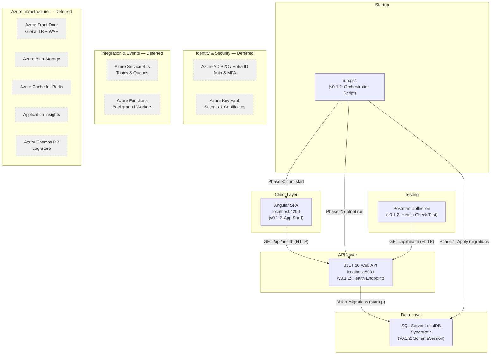
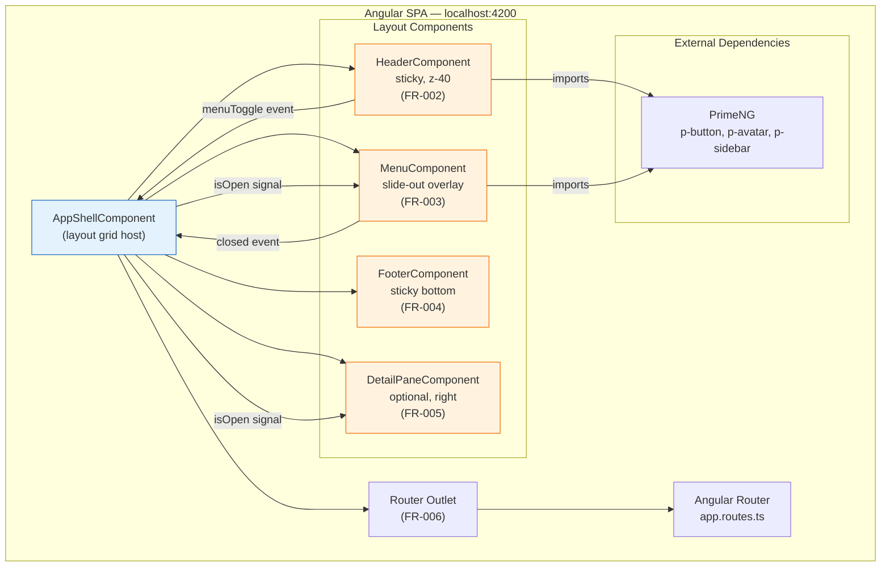
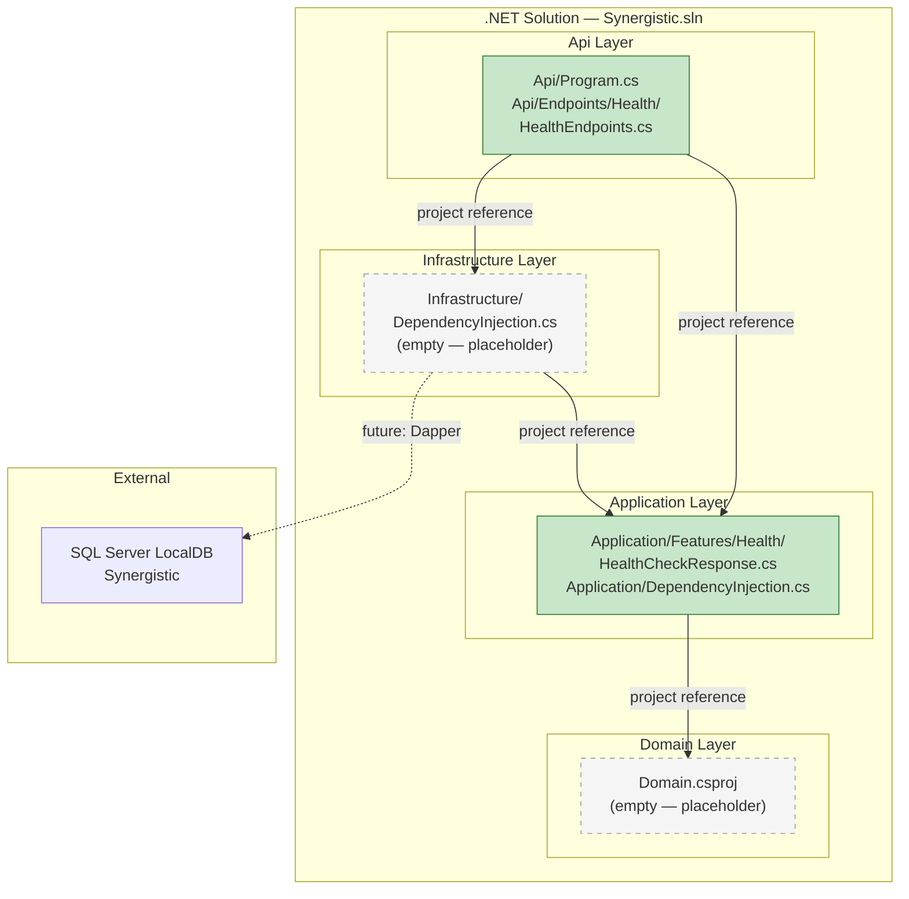
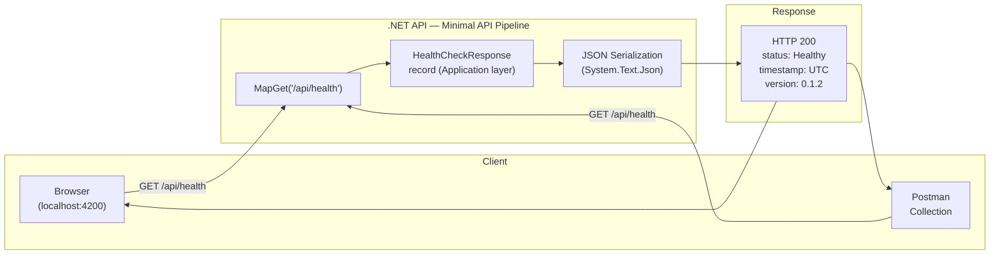
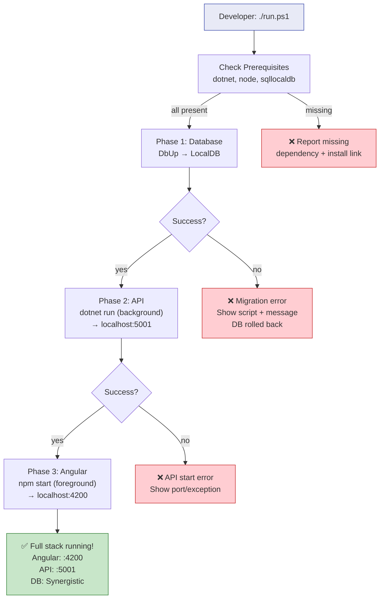

# Component Interaction Diagram — Code Initialization (v0.1.2)

**Feature**: Code Initialization — project scaffolding, containers, and database setup
**Date**: 2026-07-18
**Version**: v0.1.2

---

## 1. System-Level Integration

This diagram shows how the v0.1.2 components map onto the established system architecture from `docs/system-architecture.md`. Components prefixed with `(v0.1.2)` are new or modified in this version. Components in gray are part of the system architecture but **not implemented** in v0.1.2.

---

## 2. Angular SPA — Internal Component Structure

Shows how the v0.1.2 Angular components compose into the app shell.

---

## 3. .NET Solution — Layer Dependencies

Shows the Clean Architecture layer structure and which layers contain v0.1.2 code.

**Key**: Green = active code in v0.1.2. Gray/dashed = placeholder (project exists, no active implementations).

---

## 4. Data Flow — Health Check Request

Traces a health check request through the v0.1.2 stack from client to response.

**Note**: In v0.1.2, the health check has zero dependencies — no database, no cache, no authentication, no MediatR pipeline. It is the simplest possible endpoint.

---

## 5. Startup Orchestration — run.ps1 Flow

Shows the three-phase startup that brings the full stack online.

---

## 6. Component Dependency Matrix

| Component | Depends On | Dependency Type |
|---|---|---|
| `AppShellComponent` | `HeaderComponent`, `MenuComponent`, `FooterComponent`, `DetailPaneComponent` | Angular template composition |
| `HeaderComponent` | PrimeNG `p-button`, `p-avatar` | npm package |
| `MenuComponent` | PrimeNG `p-sidebar` | npm package |
| `FooterComponent` | None | Pure HTML/CSS |
| `DetailPaneComponent` | None | Pure HTML/CSS with `@if` |
| `HealthEndpoints.cs` | `HealthCheckResponse` (Application) | .NET project reference |
| `Program.cs` | `Application`, `Infrastructure` | .NET project reference (DI) |
| `HealthCheckResponse` | None (plain record) | No dependencies |
| `001_CreateSchemaVersion.sql` | None | Standalone SQL script |
| `run.ps1` | `dotnet`, `node`, `sqllocaldb` | System PATH |
| Postman Collection | .NET API (`localhost:5001`) | HTTP |

---

## 7. What's NOT Connected (Deferred)

These connections from `docs/system-architecture.md` are intentionally absent in v0.1.2:

| Missing Connection | Why Deferred | When It Arrives |
|---|---|---|
| Angular → Azure AD B2C (auth) | No authentication (FR-009) | Future version with user management |
| Angular → Azure Front Door | Local dev only (NFR-005) | Azure deployment |
| API → MediatR pipeline | No business logic (ADR-001) | First feature with database access |
| API → Dapper → SQL (queries) | No entity tables (ADR-001) | First feature with database access |
| API → Redis cache | No query data to cache | First feature with read-heavy queries |
| API → Service Bus | No async/event-driven flows | First feature needing background work |
| API → Serilog → Cosmos DB | Console logging only (ADR-006) | Azure deployment |
| API → Application Insights | Local dev only (ADR-006) | Azure deployment |
| API → Key Vault (secrets) | No secrets needed (NFR-005) | Azure deployment |
| API → Tenant middleware | No multi-tenancy (ADR-005) | After authentication |