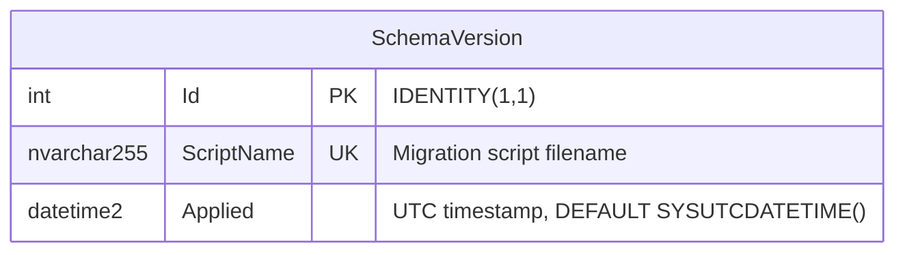
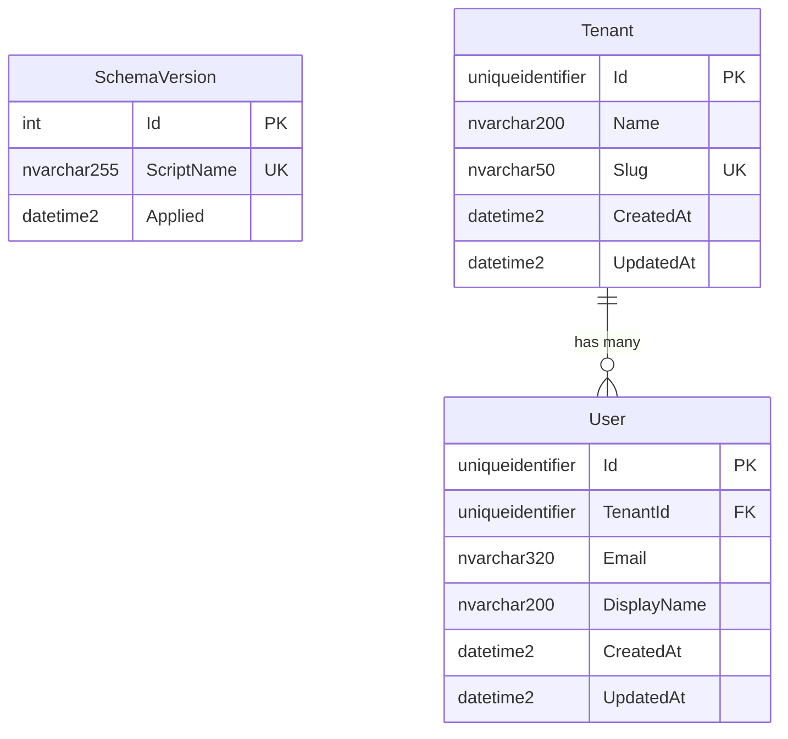

# Data Model — Code Initialization (v0.1.2)

**Feature**: Code Initialization — project scaffolding, containers, and database setup
**Date**: 2026-07-18
**Version**: v0.1.2

---

## 1. Database Overview

| Attribute | Value |
|---|---|
| **Database Name** | `Synergistic` |
| **Engine** | SQL Server LocalDB (development) / Azure SQL Database (future production) |
| **Collation** | `SQL_Latin1_General_CP1_CI_AS` (default) |
| **Recovery Model** | Simple (local dev) |
| **Migration Tool** | DbUp |
| **Tenant Model** | None in v0.1.2 (ADR-005) |

---

## 2. Entity-Relationship Diagram



v0.1.2 contains exactly one table: `dbo.SchemaVersion`. There are no entity tables, no foreign keys, and no relationships. Future versions will extend this model with tenant-scoped entity tables.

---

## 3. Table Definitions

### 3.1 dbo.SchemaVersion

**Purpose**: Tracks which migration scripts have been applied to the database. This is an infrastructure/system table — it is not a tenant entity and does not contain business data.

**Source Requirement**: FR-008 — "a `dbo.SchemaVersion` table exists to track applied migrations"

#### Column Definitions

| Column | SQL Type | Nullable | Identity | Default | Constraint | Description |
|---|---|---|---|---|---|---|
| `Id` | `int` | NOT NULL | `IDENTITY(1,1)` | — | `PRIMARY KEY CLUSTERED` | Auto-incrementing row identifier |
| `ScriptName` | `nvarchar(255)` | NOT NULL | — | — | `UNIQUE (UQ_SchemaVersion_ScriptName)` | Fully qualified migration script name (e.g., `001_CreateSchemaVersion.sql`) |
| `Applied` | `datetime2(7)` | NOT NULL | — | `SYSUTCDATETIME()` | — | UTC timestamp when the migration was successfully applied |

#### CREATE Script (001_CreateSchemaVersion.sql)

```sql
-- 001_CreateSchemaVersion.sql
-- Creates the migration tracking table if it does not exist.
-- Idempotent: safe to run multiple times.

IF NOT EXISTS (SELECT 1 FROM sys.tables WHERE name = 'SchemaVersion' AND schema_id = SCHEMA_ID('dbo'))
BEGIN
    CREATE TABLE dbo.SchemaVersion
    (
        Id          INT             NOT NULL IDENTITY(1,1),
        ScriptName  NVARCHAR(255)   NOT NULL,
        Applied     DATETIME2(7)    NOT NULL DEFAULT SYSUTCDATETIME(),

        CONSTRAINT PK_SchemaVersion
            PRIMARY KEY CLUSTERED (Id),

        CONSTRAINT UQ_SchemaVersion_ScriptName
            UNIQUE (ScriptName)
    );

    -- Record this migration as applied
    INSERT INTO dbo.SchemaVersion (ScriptName)
    VALUES ('001_CreateSchemaVersion.sql');
END;
```

#### Index Strategy

| Index | Type | Columns | Rationale |
|---|---|---|---|
| `PK_SchemaVersion` | Clustered, unique | `Id` | Primary key — auto-incrementing integer is the ideal clustered index key (narrow, ever-increasing) |
| `UQ_SchemaVersion_ScriptName` | Non-clustered, unique | `ScriptName` | DbUp queries by script name on startup to determine which migrations are pending. Guarantees no duplicate script application. |

**No additional indexes needed.** The `SchemaVersion` table is tiny (one row per migration, maybe dozens over the lifetime of the project). Additional indexes would add write cost with zero query benefit.

---

## 4. Migration Strategy

### 4.1 Versioning Convention

```
{sequenceNumber}_{Description}.sql
```

| Example | Description |
|---|---|
| `001_CreateSchemaVersion.sql` | Initial migration — creates the tracking table |
| `002_CreateTenantsTable.sql` | Future — creates the Tenants entity table |
| `003_AddUserTable.sql` | Future — creates the Users entity table |

### 4.2 Idempotency Rules

Every migration script MUST:
1. Check for object existence before creating (`IF NOT EXISTS (SELECT 1 FROM sys.tables WHERE name = '...')`)
2. Be safe to run multiple times without error or data loss
3. Never use `DROP` without a corresponding `CREATE` guarded by existence checks

### 4.3 Migration Execution

DbUp runs on application startup (triggered by `run.ps1` or a `--migrate` CLI flag). DbUp queries `dbo.SchemaVersion` to determine which scripts have already been applied, then runs only pending scripts in sequence number order within a transaction per script.

```
┌──────────────────────────────────────────────────────┐
│                  Application Start                    │
└─────────────────────┬────────────────────────────────┘
                      ▼
┌──────────────────────────────────────────────────────┐
│  DbUp: Query dbo.SchemaVersion for applied scripts   │
└─────────────────────┬────────────────────────────────┘
                      ▼
┌──────────────────────────────────────────────────────┐
│  Compare with scripts in migrations/ folder          │
└─────────────────────┬────────────────────────────────┘
                      ▼
              ┌───────┴───────┐
              │ Pending?       │
              └───────┬───────┘
          Yes         │         No
          ▼           │         ▼
┌──────────────────┐  │  ┌──────────────────┐
│ Run pending      │  │  │ Skip — database  │
│ scripts in order │  │  │ is up to date    │
└────────┬─────────┘  │  └──────────────────┘
         ▼            │
┌──────────────────┐  │
│ Record each       │  │
│ script in         │  │
│ SchemaVersion     │  │
└──────────────────┘  │
                      ▼
              ┌──────────────┐
              │ Start API     │
              └──────────────┘
```

### 4.4 Scripted Copy for AI Models

Per FR-008, a scripted copy of all database objects is generated into `source/03-sql/script/`. This is produced after each migration run by scripting out the database via:

```powershell
sqlcmd -S (LocalDB)\MSSQLLocalDB -d Synergistic -Q "SELECT definition FROM sys.sql_modules" > source\03-sql\script\schema-snapshot.sql
```

Or via a DbUp post-migration hook that scripts all objects using SMO (SQL Server Management Objects).

---

## 5. Tenant Partitioning Strategy

**Not applicable for v0.1.2** (ADR-005). The only table (`SchemaVersion`) is a system table that tracks global migration state. It does not contain tenant data and will never be tenant-scoped.

When tenant support is introduced (future version, after authentication):
- Every entity table will include a `TenantId uniqueidentifier NOT NULL` column
- A non-clustered index on `TenantId` will be standard on every entity table
- Row-Level Security (RLS) predicates will enforce `TenantId` isolation at the database level
- DbUp migrations will add `TenantId` columns to new entity tables, never retroactively to system tables like `SchemaVersion`

---

## 6. Future Data Model Preview (Informational)

This section is non-normative — it illustrates how the data model will evolve in future versions to inform architectural thinking. Actual schemas will be designed in their respective feature versions.



- **Tenant** — the top-level organizational unit. All entity tables reference `Tenant.Id` via `TenantId`.
- **User** — a person with access to one tenant. `TenantId` + `Email` is unique.
- Every entity table includes `CreatedAt` and `UpdatedAt` audit columns.
- Primary keys exposed to the client use `uniqueidentifier` (GUIDs) per system architecture. Internal-only tables (like `SchemaVersion`) use `int` identity.

---

## 7. Data Model Checklist

- [x] Table definitions complete with column types, nullability, constraints
- [x] Index strategy documented and justified
- [x] Migration path clear — `001_CreateSchemaVersion.sql` is the starting point
- [x] All scripts are idempotent (existence checks before CREATE)
- [x] Tenant partitioning strategy addressed (none needed in v0.1.2)
- [x] No cascading deletes (no foreign keys exist)
- [x] No PII or sensitive data in v0.1.2 (NFR-006)
- [x] Migration tooling specified (DbUp)
- [x] Scripted copy path for AI model access defined (`source/03-sql/script/`)