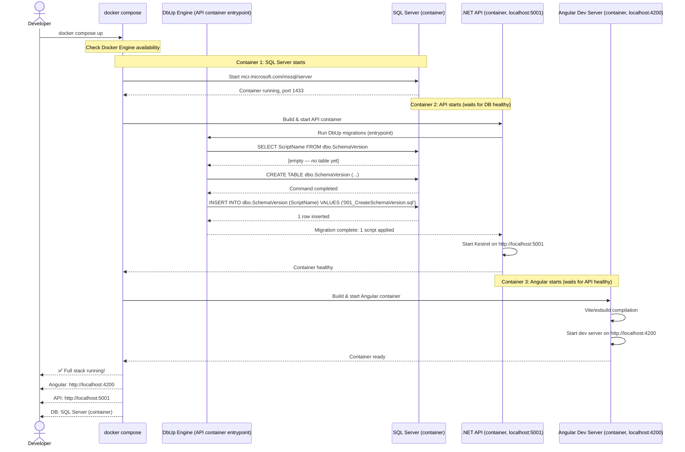
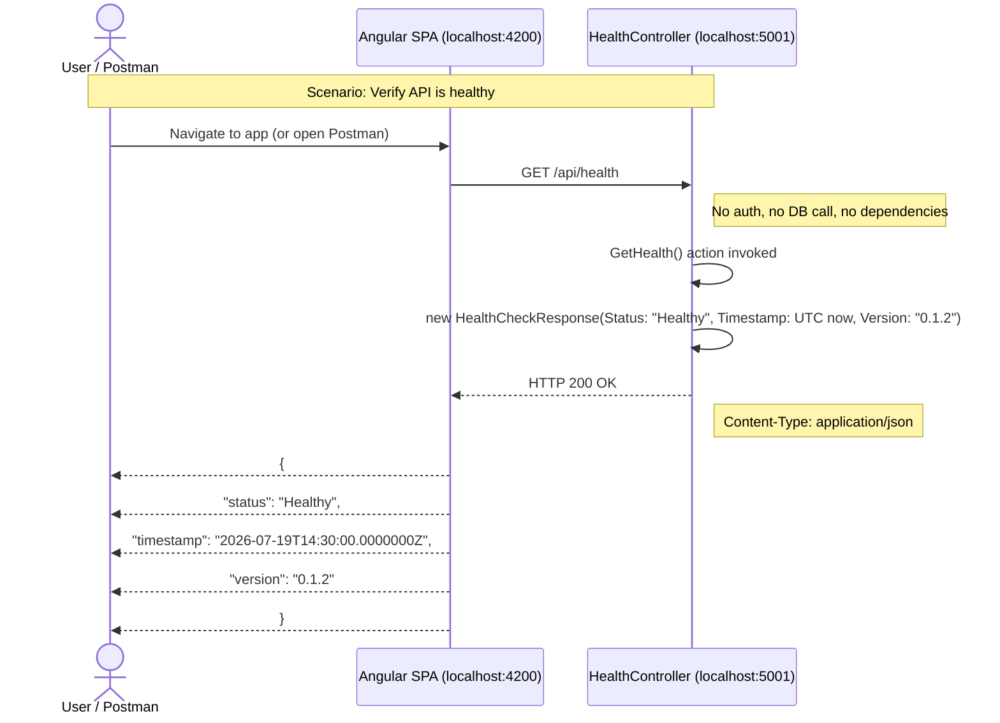
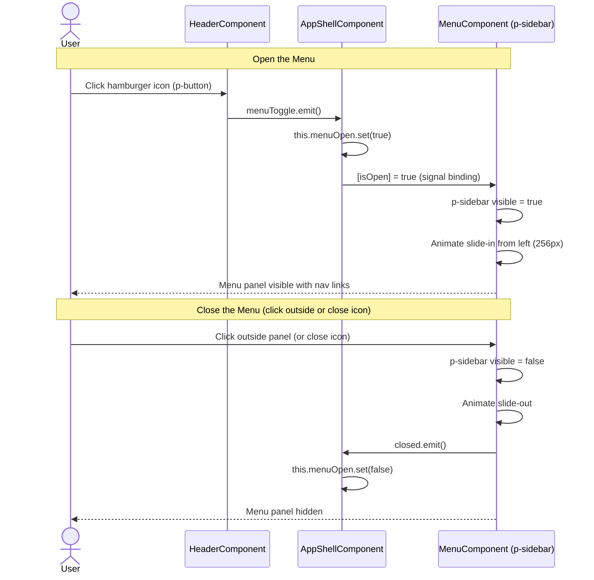
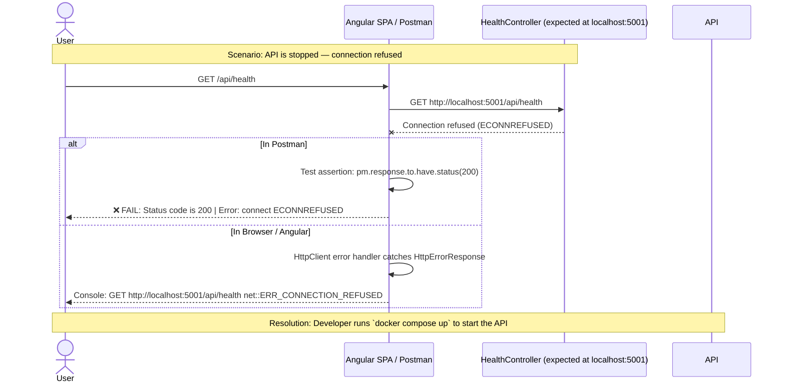
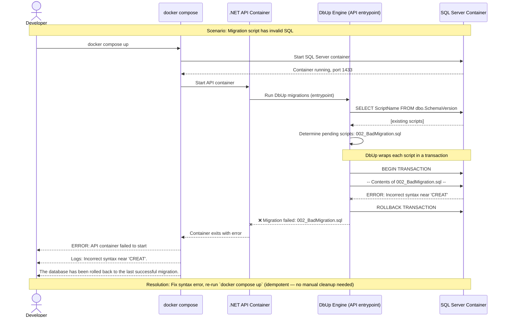
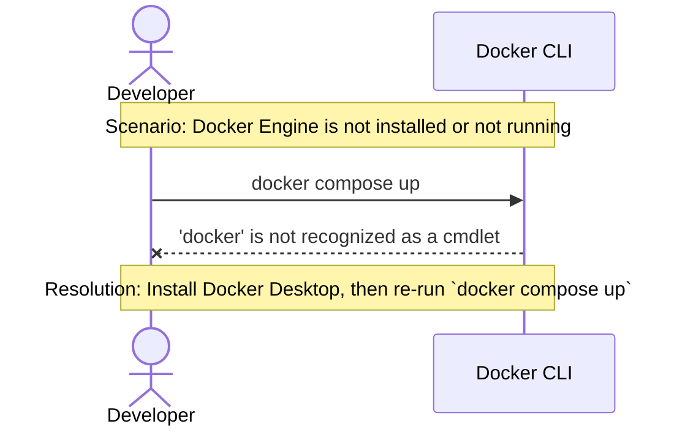
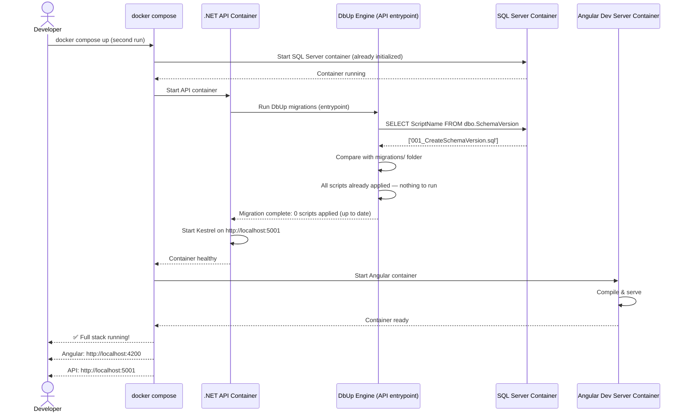

# Sequence Diagrams — Code Initialization (v0.1.2)

**Feature**: Code Initialization — project scaffolding, containers, and database setup
**Date**: 2026-07-18
**Version**: v0.1.2

---

## 1. Full-Stack Startup — Happy Path

The developer runs `docker compose up` and the entire stack comes up. This covers FR-001.

---

## 2. Health Check — Happy Path

The Angular app (or browser or Postman) calls the health check endpoint and gets a successful response. Covers FR-007.

---

## 3. Navigation Menu Toggle — Happy Path

The user clicks the hamburger icon to open the slide-out menu, then closes it. Covers FR-002 and FR-003.

---

## 4. Error Path — API Unavailable

The user tries to access the health check while the .NET API is not running. The request fails with a connection error. Covers error handling for FR-007.

---

## 5. Error Path — Database Migration Failure

DbUp encounters an error while applying a migration script — for example, a syntax error in the SQL or the DB container not running. Covers error handling for FR-008.

---

## 6. Prerequisites Check — Missing Dependency

The developer runs `docker compose up` without having Docker Engine installed. Docker Desktop provides helpful guidance.

---

## 7. Full-Stack Startup — Already Initialized (Idempotent Re-run)

The developer runs `docker compose up` again after the database already exists. DbUp detects no pending migrations and skips the database phase. Covers the idempotency requirement in FR-008 and ADR-004.

---

## Diagram Summary

| Diagram | Type | Covers | Key Principles |
|---|---|---|---|
| 1. Full-Stack Startup | Happy path | FR-001, FR-007, FR-008 | Separation of Concerns, Idempotency |
| 2. Health Check | Happy path | FR-007 | Single Responsibility, Controller Pattern |
| 3. Navigation Menu Toggle | Happy path | FR-002, FR-003 | Event-driven UI, Component isolation |
| 4. API Unavailable | Error path | FR-007 | Graceful degradation, clear error messaging |
| 5. Database Migration Failure | Error path | FR-008 | Transactional safety, auto-rollback |
| 6. Missing Prerequisites | Error path | FR-001 | Fail fast, helpful guidance |
| 7. Idempotent Re-run | Happy path | FR-008, ADR-004 | Idempotency, repeatable infrastructure |