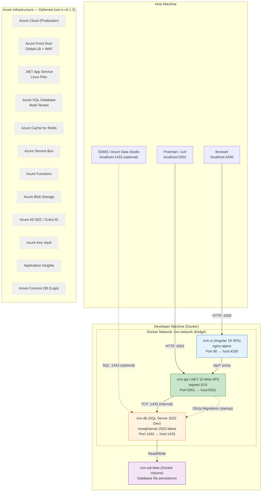
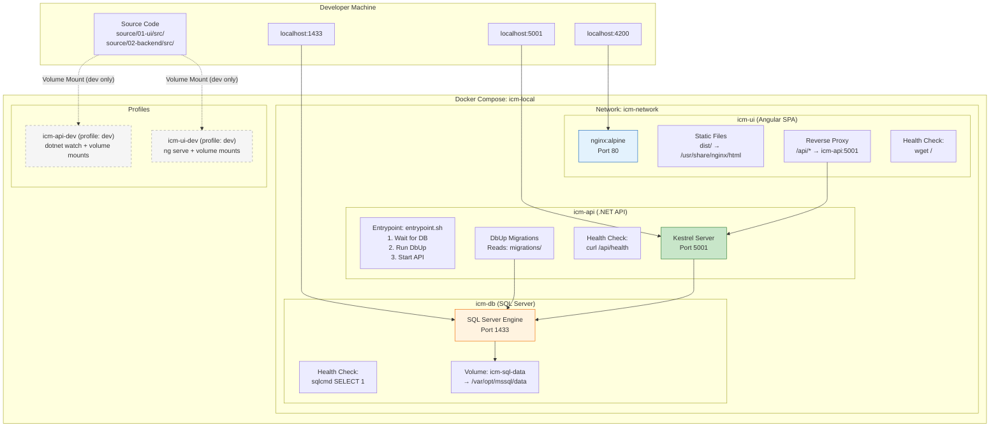
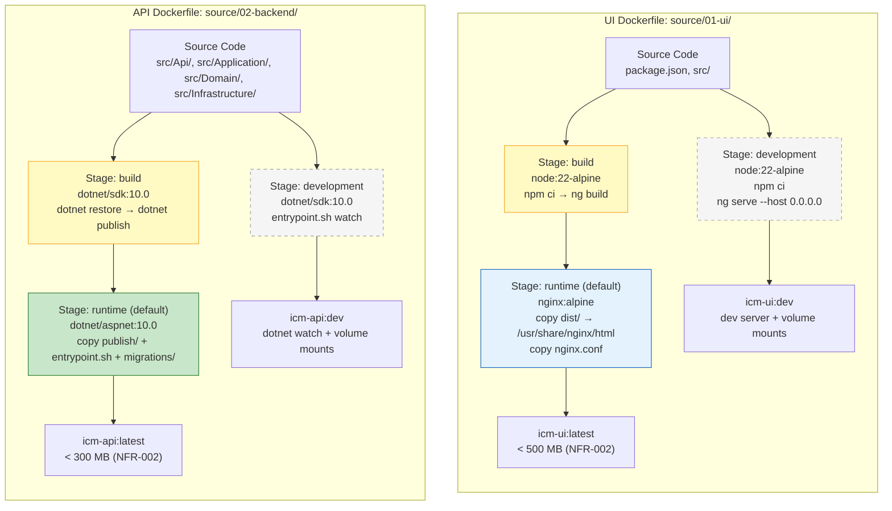
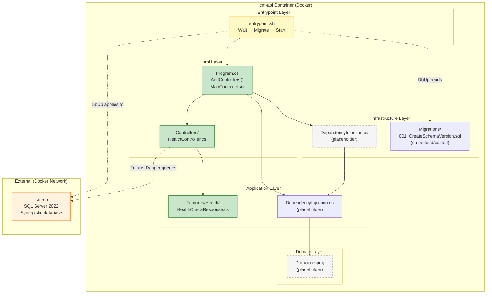
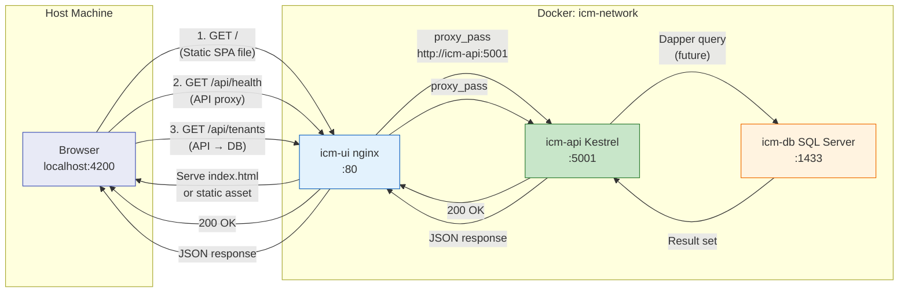
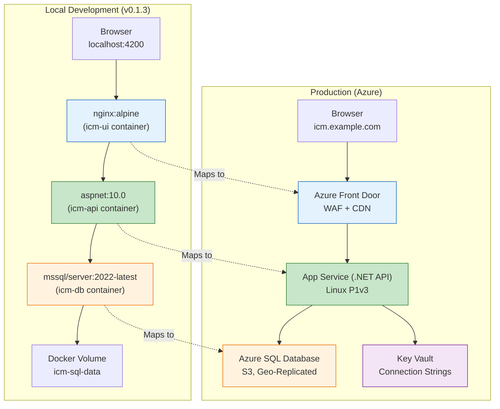
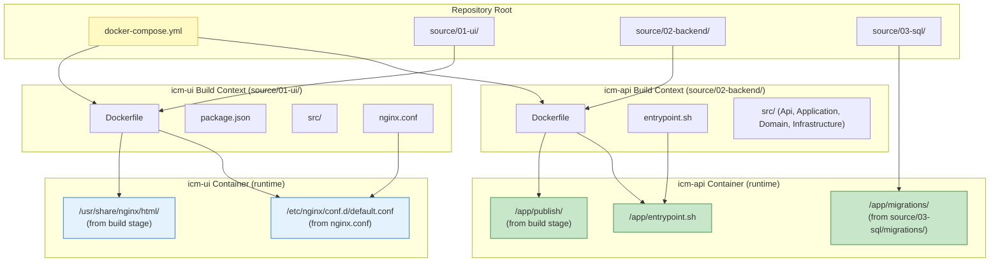

# Component Interaction Diagram — Docker Local Development (v0.1.3)

**Feature**: Docker Local Development — Dockerfiles, Compose orchestration, and local containerized workflow
**Date**: 2026-07-20
**Version**: v0.1.3

---

## 1. System-Level Integration

This diagram shows how the v0.1.3 Docker containers map onto the established system architecture from `docs/system-architecture.md`. All three containers run locally on the developer's machine, replacing the Azure services with Docker equivalents.

---

## 2. Docker Compose Orchestration View

Shows the startup dependencies, health checks, and data flows between containers as defined in `docker-compose.yml`.

---

## 3. Dockerfile Build Pipeline

Shows the multi-stage build process for both custom images (UI and API), including layer caching strategy.

---

## 4. .NET Solution — Layer Dependencies (Docker Context)

Shows how the Clean Architecture layers map into the Docker container. The key difference from v0.1.2 is that the API runs inside a container with DbUp and an entrypoint script.

---

## 5. Network Traffic Flow — Request Paths

Shows the three primary request paths through the Docker stack.

**Key observations:**
- **Path 1** (Static files): Browser → nginx → Browser. No API involvement. Fast, cached responses.
- **Path 2** (API health): Browser → nginx → API → nginx → Browser. API is reached via nginx proxy, not directly. This mirrors the production Front Door pattern.
- **Path 3** (API with data): Browser → nginx → API → SQL → API → nginx → Browser. Full round-trip through every layer. This is the production-equivalent data flow.

---

## 6. Environment Comparison — Local Docker vs. Production Azure

---

## 7. File System Map — Repository to Docker Context

Shows which files are copied into which container stages.

---

## 8. Component Traceability Matrix

| Diagram | FR-001 | FR-002 | FR-003 | FR-004 | FR-005 | FR-006 | FR-007 | FR-008 | NFR-001 | NFR-002 | NFR-003 | NFR-004 |
|---|---|---|---|---|---|---|---|---|---|---|---|---|
| System-Level Integration | ✅ | ✅ | ✅ | ✅ | ✅ | ✅ | | | | | ✅ | |
| Docker Compose Orchestration | | | ✅ | ✅ | ✅ | ✅ | ✅ | ✅ | | | | |
| Dockerfile Build Pipeline | ✅ | ✅ | | | | | | | | ✅ | | |
| .NET Solution (Docker Context) | | ✅ | | | | | ✅ | | | | | |
| Network Traffic Flow | ✅ | ✅ | | | | ✅ | | | | | | |
| Environment Comparison | ✅ | ✅ | ✅ | | | | | | | | | |
| File System Map | ✅ | ✅ | ✅ | | | | ✅ | | | | | |

---

*All diagrams trace to functional and non-functional requirements from Stage 01. The established system architecture diagram style from `docs/system-architecture.md` is used throughout.*