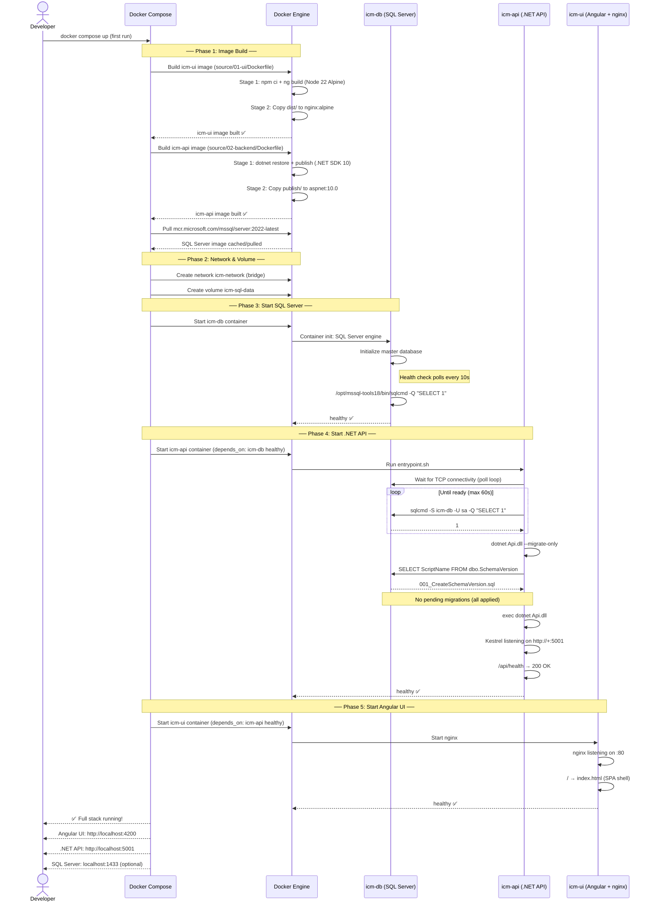
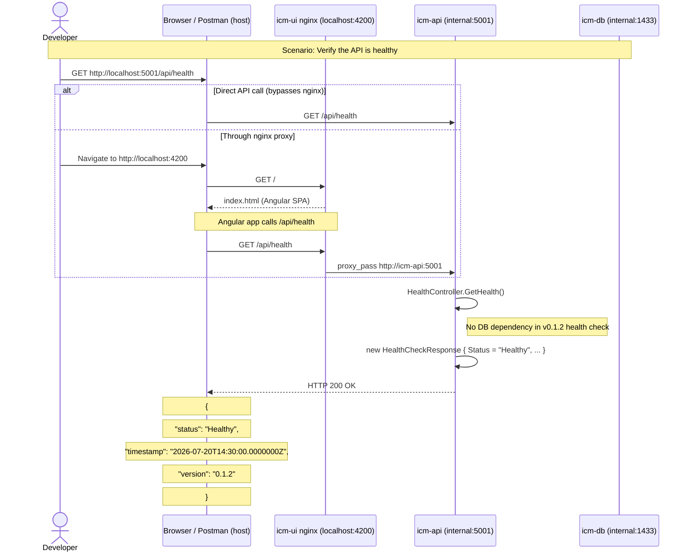
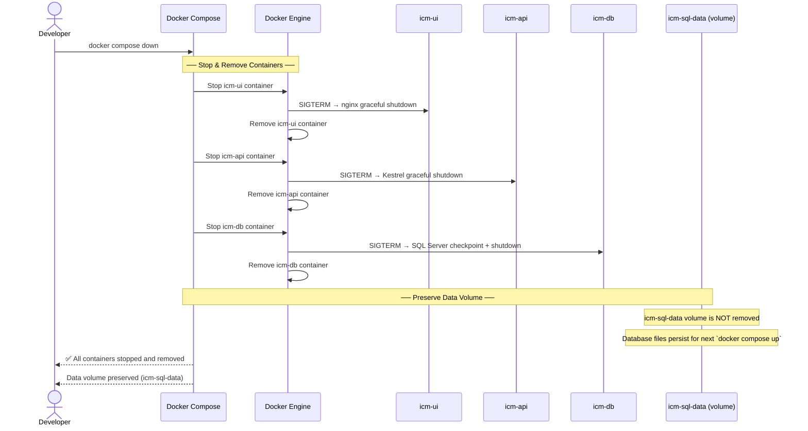
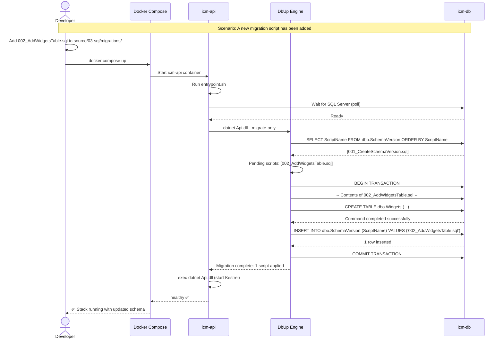
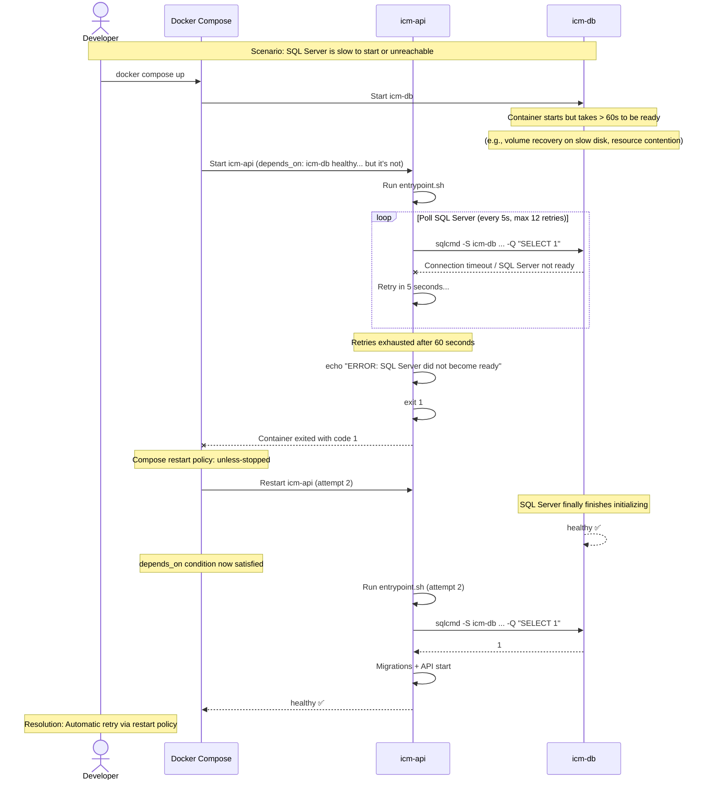
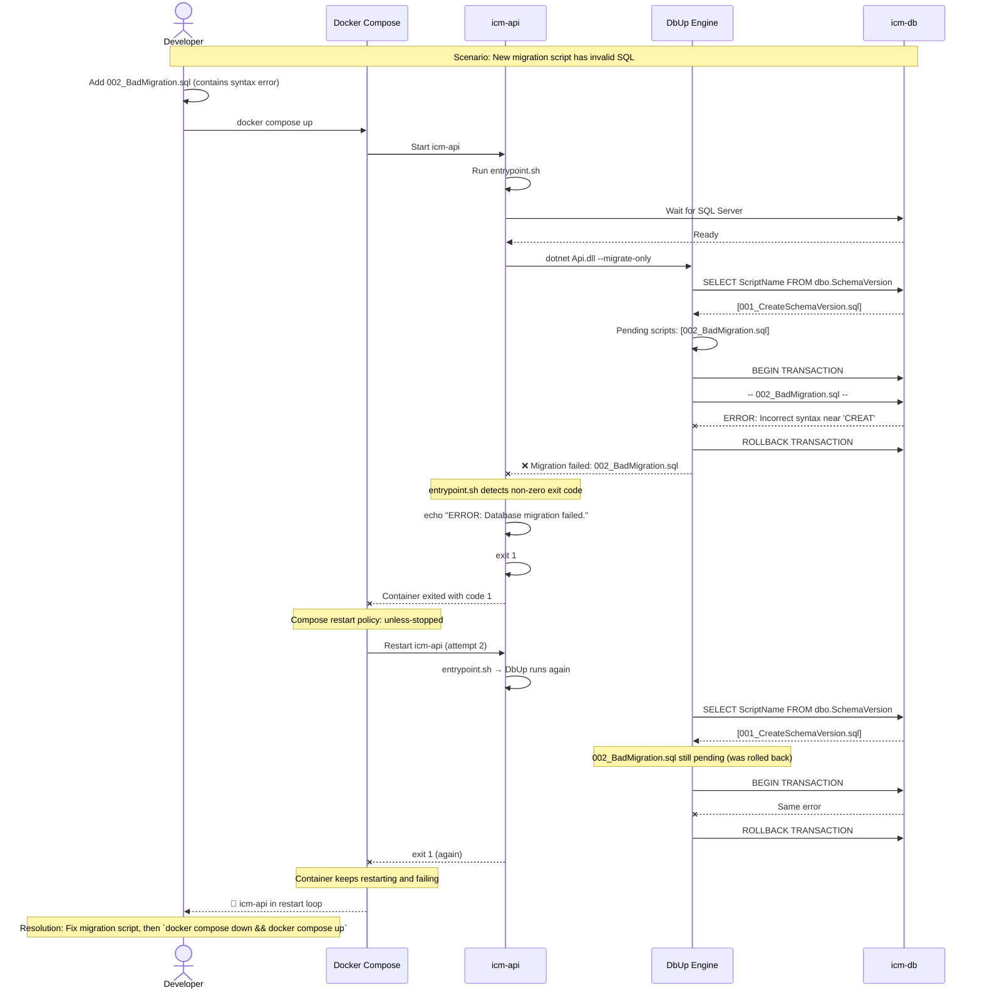
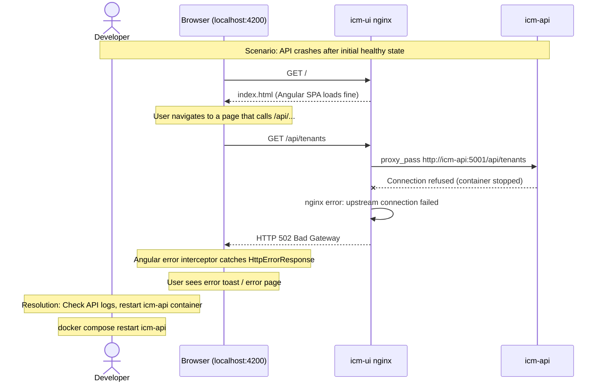
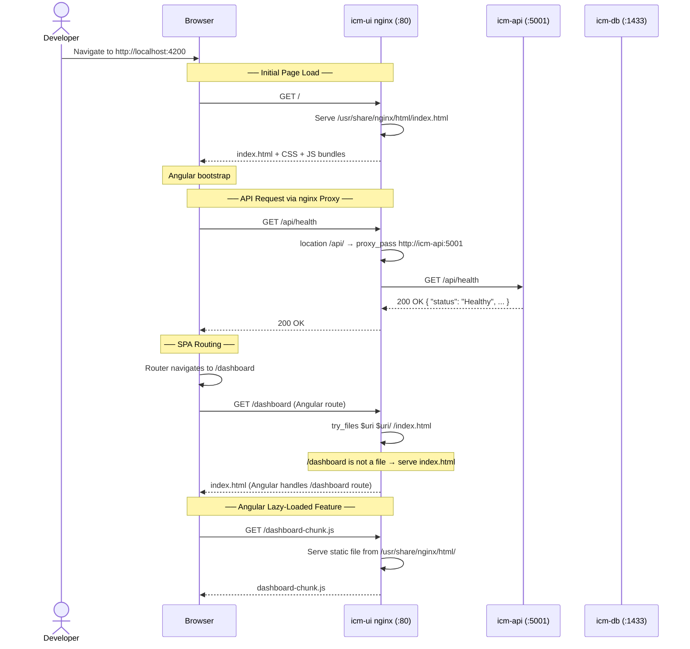
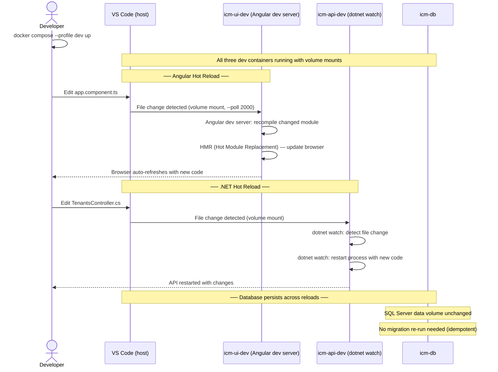
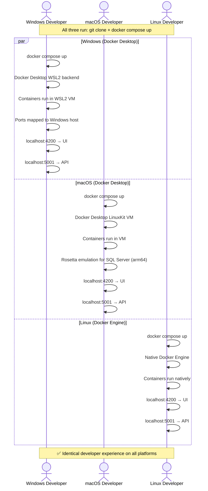

# Sequence Diagrams — Docker Local Development (v0.1.3)

**Feature**: Docker Local Development — Dockerfiles, Compose orchestration, and local containerized workflow
**Date**: 2026-07-20
**Version**: v0.1.3

---

## 1. Full-Stack Cold Start — Happy Path

The developer clones the repository and runs `docker compose up` for the first time. Docker builds images, starts all containers, and the full stack becomes healthy. Covers FR-001 through FR-007.

**Performance Note:** NFR-001 requires cold start within 120 seconds. The bottleneck is SQL Server initialization (~30–45 seconds cold, ~10 seconds warm with persistent volume). API and UI build times are amortized by Docker layer caching — first build may take 2–3 minutes, but subsequent `docker compose up` runs use cached layers and complete within the 120-second threshold.

---

## 2. Health Check Request — Happy Path

The developer verifies the API is running by calling the health endpoint from the browser or Postman. Covers FR-002 (API is functional).

---

## 3. Stack Teardown — Happy Path

The developer runs `docker compose down` to stop and clean up all containers. Covers FR-004 (teardown is as simple as startup).

---

## 4. Database Migration — Happy Path (New Migration)

A new migration script (`002_AddWidgetsTable.sql`) is added. On the next `docker compose up`, DbUp detects the pending script and applies it. Covers FR-007 (idempotent migrations).

---

## 5. Error Path — SQL Server Not Ready (Timeout)

The API container starts but SQL Server does not become ready within 60 seconds. The entrypoint script times out and the API container exits with an error. Covers error handling for FR-007.

---

## 6. Error Path — Migration Script Failure

A migration script contains a SQL syntax error. DbUp rolls back the transaction and the API container fails to start. Covers error handling for FR-007.

---

## 7. Error Path — API Unreachable from nginx Proxy

The API container is stopped or crashes after the UI container has started. nginx returns 502 Bad Gateway when proxying API requests. Covers error handling for FR-006 (external access).

---

## 8. Angular UI Navigation via nginx Proxy — Happy Path

The developer accesses the Angular SPA through the nginx container, which serves static files and proxies API requests. Covers FR-001 and FR-006.

---

## 9. Development Mode — Hot Reload Flow

The developer uses the `dev` profile to get hot reload. They edit a TypeScript file and see the change reflected immediately. Covers FR-008.

---

## 10. Cross-Platform Startup — Windows / macOS / Linux

The same `docker compose up` works identically on all three platforms. Covers NFR-004.

---

*All diagrams trace to functional requirements (FR-001 through FR-008) and non-functional requirements (NFR-001, NFR-002, NFR-003, NFR-004) from Stage 01.*
